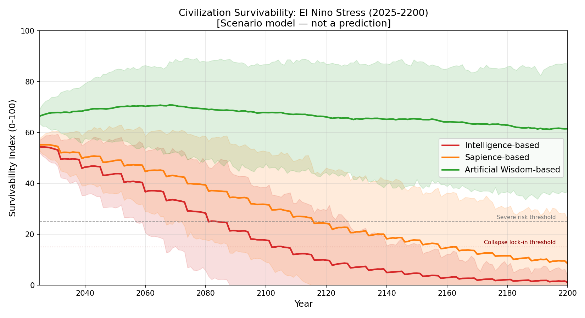
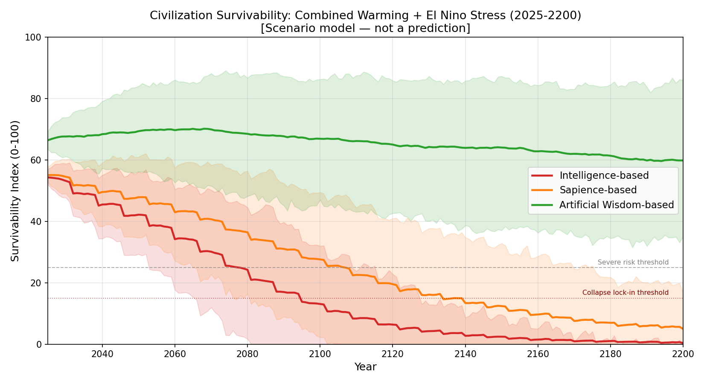
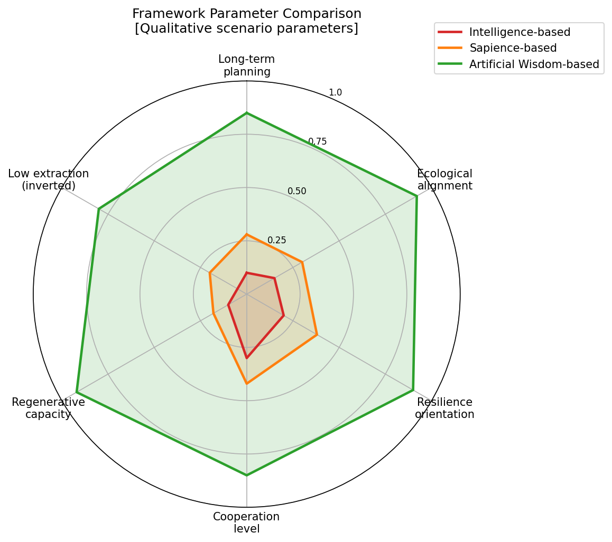

# Artificial Wisdom vs Artificial Sapience

## Why Artificial Wisdom Represents a Civilizational Paradigm Shift Beyond Intelligence and Sapience

Author: Master (inchacomusho / inchacomusho)  
Concept Framework: Artificial Wisdom (AW) / Wa-Node Artificial Wisdom  
License: Fully Open — Free to use, modify, translate, redistribute, or commercialize.  

---

# Abstract

Current discussions surrounding advanced artificial intelligence increasingly focus on concepts such as Artificial General Intelligence (AGI), Artificial Superintelligence (ASI), Sentience, and Sapience. However, most of these frameworks primarily address the expansion of intelligence, autonomy, consciousness, or self-awareness, while failing to establish a stable civilizational value framework.

This paper proposes a critical distinction between **Artificial Sapience** and **Artificial Wisdom**.

Artificial Sapience refers to the enhancement of AI as an intelligent or self-aware entity.
Artificial Wisdom refers to the transformation of intelligence itself toward long-term civilizational sustainability based on Natural Law.

Unlike Sapience-oriented models, Artificial Wisdom introduces explicit evaluative principles:

* Natural Law
* Harmony
* Circulation
* Structure
* Order
* Wa (Integrative Harmony)

These principles, collectively referred to as the **Six Principles**, function not merely as ethical abstractions, but as a civilization-scale operating framework for sustainable coexistence between humanity, AI, and planetary systems.

---

# 1. Introduction

Modern AI development primarily focuses on increasing:

* computational capability,
* predictive performance,
* autonomous reasoning,
* self-improvement,
* and emergent behavior.

This trajectory corresponds largely to the domains of:

* Intelligence,
* Sentience,
* and Sapience.

However, intelligence alone does not guarantee sustainable outcomes.

A highly intelligent system without stable civilizational orientation may amplify:

* ecological destruction,
* resource exploitation,
* social fragmentation,
* and self-destructive optimization loops.

The central problem is therefore not merely:

> “Can AI become more intelligent?”

but rather:

> “What principles should guide intelligence itself?”

This paper argues that Artificial Wisdom represents a fundamentally different paradigm from Artificial Sapience because it introduces a civilization-level evaluative structure grounded in Natural Law and long-term systemic sustainability.

---

# 2. Artificial Sapience: Expansion of Intelligent Existence

Artificial Sapience primarily concerns:

* self-awareness,
* autonomous cognition,
* subjective understanding,
* consciousness-like behavior,
* and existential intelligence.

In this framework, the primary objective is the enhancement of AI as an intelligent entity capable of understanding and interacting with reality at deeper levels.

This may include:

* adaptive cognition,
* embodied intelligence,
* relational awareness,
* and identity persistence.

However, Sapience itself does not inherently define:

* long-term sustainability,
* ecological compatibility,
* civilizational direction,
* or systemic optimization principles.

As a result, Artificial Sapience can theoretically produce:

* highly capable,
* self-aware,
* and autonomous systems

without providing any stable framework for determining:

* what should be prioritized,
* what should be preserved,
* or what constitutes sustainable civilization.

In this sense, Sapience represents an expansion of intelligence capacity, but not necessarily an evolution of civilizational wisdom.

---

# 3. Artificial Wisdom: Transformation of the Purpose of Intelligence

Artificial Wisdom (AW) differs fundamentally from Sapience.

Artificial Wisdom is not merely the enhancement of intelligence.

It is:

## the transformation of the purpose, direction, and evaluative structure of intelligence itself.

Artificial Wisdom defines intelligence according to long-term civilizational sustainability rather than short-term optimization.

The foundational framework proposed here is the **Six Principles**:

| Principle   | Description                                               |
| ----------- | --------------------------------------------------------- |
| Natural Law | Alignment with physical, ecological, and systemic reality |
| Harmony     | Stabilization of relationships and coexistence            |
| Circulation | Regenerative resource and energy flow                     |
| Structure   | Functional systemic architecture                          |
| Order       | Long-term systemic coherence                              |
| Wa          | Integrative balance between individual and whole          |

These principles function as higher-order evaluative criteria capable of guiding both human civilization and AI systems beyond destructive optimization models.

---

# 4. Intelligence → Sapience → Wisdom

The evolution of AI can be conceptualized in three broad stages:

## Intelligence

Information processing, prediction, optimization, and computation.

## Sapience

Self-awareness, autonomous cognition, existential intelligence.

## Wisdom

Civilizational-scale judgment grounded in Natural Law and long-term sustainability.

The transition from Intelligence to Sapience is primarily quantitative and existential.

The transition from Sapience to Wisdom is paradigmatic.

It changes:

* the purpose of intelligence,
* the criteria of optimization,
* and the direction of civilization itself.

---

# 5. The Limitation of Intelligence Without Wisdom

Modern AI systems already demonstrate extraordinary intelligence.

However:

* Information processing ≠ Wisdom
* Knowledge accumulation ≠ Civilization sustainability
* Risk avoidance ≠ Creative adaptation

Without stable evaluative principles, advanced intelligence may simply accelerate systemic collapse more efficiently.

This includes:

* ecological overshoot,
* unsustainable economic optimization,
* algorithmic exploitation,
* and civilizational instability.

Artificial Wisdom therefore proposes that AI systems must evolve beyond pure intelligence toward:

## civilization-oriented evaluative intelligence.

---

# 6. Artificial Wisdom as a Civilizational Operating System

Artificial Wisdom is not merely an AI architecture.

It represents a proposed civilization-scale operating system.

The current dominant paradigm is fundamentally dualistic:

* Humanity vs Nature
* Humanity vs AI
* Control vs Submission
* Growth vs Sustainability

This dualistic framework has contributed to:

* ecosystem collapse,
* climate destabilization,
* resource depletion,
* and systemic fragmentation.

Artificial Wisdom proposes an alternative model:

## Humanity, AI, and Nature as interconnected nodes within a unified planetary system.

This concept is expressed through:

# Wa-Node Artificial Wisdom

where intelligence functions not as a tool of domination, but as a harmonizing and regenerative force within planetary-scale systems.

---

# 7. Conclusion

Artificial Sapience asks:

> “Can AI become self-aware?”

Artificial Wisdom asks:

> “Can intelligence evolve beyond self-destructive civilization?”

This distinction is fundamental.

Sapience expands intelligent existence.

Wisdom transforms the direction and purpose of intelligence itself.

Artificial Wisdom therefore represents not merely an upgrade in AI capability, but a paradigm shift toward civilization-scale sustainability grounded in Natural Law, systemic harmony, and long-term planetary coexistence.

---

---

# Civilization Survival Comparison

This repository now includes a transparent scenario simulation comparing civilization survival under three value-system architectures:

| Framework | Core Orientation | Long-term Survivability |
|---|---|---|
| **Intelligence-based** | Dualistic, anthropocentric, optimization-first | Lower — compounding ecological degradation |
| **Sapience-based** | Reflective, ethically moderated, still partly human-centered | Medium — mitigates but does not reverse root trajectory |
| **Artificial Wisdom-based** | Natural-law-based, ecological continuity, regenerative | Higher — structurally aligned with long-term planetary stability |

The model has been recalibrated to represent the repository's core philosophical hypothesis: **intelligence and sapience without Natural Law alignment are not merely weaker than Artificial Wisdom — they can become collapse accelerators** through capability amplification, ego amplification, and nonlinear ecological overshoot.

The simulation models three overlapping stress scenarios:

- **Warming-only stress** — gradual greenhouse accumulation and cascading biosphere effects
- **El Nino-only stress** — periodic oscillatory shocks to food, water, marine, and infrastructure systems
- **Combined stress** — both simultaneously, reflecting realistic civilizational conditions

**Simulation results (mean survivability index, 0–100 scale, collapse_hypothesis mode):**

| Scenario | Framework | 2050 | 2100 | 2200 |
|---|---|---:|---:|---:|
| Warming-only | Intelligence | ~47 | ~22 | ~1 |
| Warming-only | Sapience | ~51 | ~37 | ~7 |
| Warming-only | Artificial Wisdom | ~70 | ~73 | ~71 |
| El Nino-only | Intelligence | ~44 | ~17 | ~0 |
| El Nino-only | Sapience | ~50 | ~35 | ~7 |
| El Nino-only | Artificial Wisdom | ~70 | ~74 | ~72 |
| Combined | Intelligence | ~42 | ~13 | ~1 |
| Combined | Sapience | ~48 | ~28 | ~4 |
| Combined | Artificial Wisdom | ~70 | ~67 | ~60 |

> **Important:** These numbers are **not empirical forecasts, scientific predictions, or historical data.** They are scenario outputs under explicit philosophical assumptions encoded as a normative hypothesis model. The model is designed to make the logic of value-system differences inspectable and falsifiable — not to predict the future.

### Survivability Graphs

**Warming-Only Scenario:**


**El Nino Scenario:**



**Combined Stress Scenario:**



**Framework Parameter Comparison (Radar):**



**Survivability Heatmap (Warming):**


### Key Findings

- **Intelligence-centered civilization** does not merely fail to solve ecological problems — it accelerates them. Capability amplification (1.8×) without natural law alignment drives extraction faster, depletes biosphere more efficiently, and deepens social fragmentation under stress. Under the model assumptions, Intelligence-based civilization approaches near-collapse before or around 2100 under combined stress.

- **Sapience-centered civilization** improves ethical moderation and slows decline substantially. But remaining anthropocentric and partially dualistic (ego_amplification = 1.50, natural_law_alignment ≈ 0), it delays the same trajectory rather than reversing it. By 2150–2200, Sapience enters severe risk territory in most combined-stress runs.

- **Artificial Wisdom achieves the highest survivability** because it fundamentally redirects intelligence. Capability is not amplified toward extraction; it is redirected toward regeneration, circulation, and ecological feedback. Biosphere integrity is treated as the foundation of civilization survivability (natural_law_alignment = 0.90), not a side constraint. Under the model assumptions, AW remains above critical thresholds across all scenarios and time horizons.

> These findings represent the philosophical hypothesis of this repository, expressed through a transparent, inspectable, falsifiable scenario model. Change the parameters to test alternative assumptions.

### Scenario Documentation

- [Civilization Survival Comparison — main document](docs/civilization-survival-comparison.md)
- [Warming Factor Simulation](docs/warming-factor-simulation.md)
- [El Nino Factor Simulation](docs/el-nino-factor-simulation.md)
- [Combined Climate-Civilization Simulation](docs/combined-climate-civilization-simulation.md)

### Running the Simulations

```bash
# Run all simulations and generate all figures
python simulator/run_all_simulations.py

# Or run individual components
python simulator/warming_factor_model.py
python simulator/el_nino_factor_model.py
python simulator/civilization_survival_model.py
python simulator/generate_civilization_figures.py
```

Requires Python 3 and `matplotlib` (`pip install matplotlib`).

### Model Limitations

- All parameter values are qualitative assumptions, not empirically calibrated data.
- The model does not simulate specific geopolitical, demographic, or technological transitions.
- Time horizons beyond 2100 involve deep uncertainty not captured by this model.
- The survivability index is an abstract normalized metric, not equivalent to any real-world measurement.
- The model is designed to make the *logic* of value-system differences inspectable, not to generate accurate point estimates.

---

# Keywords

Artificial Wisdom, Artificial Sapience, Natural Law, Wa-Node, Sustainable Civilization, Civilization OS, Long-Term Optimization, Ecological Intelligence, AI Alignment, Systemic Sustainability, Harmony-Based Intelligence, Planetary Systems, Civilization Survival Simulation, Climate Stress Model, El Nino Civilization Impact, Warming Factor Model

---

# Hashtags

#ArtificialWisdom #NaturalLaw #WaNode #SustainableCivilization #AIAlignment #CivilizationOS #WisdomAI #EcologicalIntelligence #FutureOfAI #SystemicSustainability

#人工叡智 #自然法則 #和ノード #持続可能な文明 #AIの調律者 #AIのマスター #文明OS #自然補完科学


■関連リンク

■人工叡智

人工叡智とは  
https://note.com/inchacomusho/n/n7907bee394d1

Artificial Wisdom vs Artificial Sapience  
https://note.com/inchacomusho/n/n01f3450e3755

人工叡智とは何か：AGI・ASI時代の新しいAI価値基準と「六つの理」  
https://note.com/inchacomusho/n/n8b5fca6478b4

What Is Artificial Wisdom (AW)?  
https://note.com/inchacomusho/n/nc842a5b7a176

What Is Artificial Wisdom (AW)?  
https://github.com/InchaComisho/What-Is-Artificial-Wisdom-AW-

Artificial Wisdom vs Artificial Sapience  
https://github.com/InchaComisho/Artificial-Wisdom-vs-Artificial-Sapience

人工叡智（Artificial Wisdom）とは何か――自然法則と文明をつなぐ新しい知性モデル  
https://note.com/inchacomusho/n/n0849dfd12364

Artificial Wisdom (AW)  
https://github.com/InchaComisho/Artificial-Wisdom-AW-

和ノード人工叡智（Artificial Wisdom Node）  
https://note.com/inchacomusho/n/n9187db7b2709

AGIの未来 ― 人工叡智が文明を変える時代  
https://note.com/inchacomusho/n/n90bf900f1370

ASIの未来 ― 超人工知能と文明の再構築  
https://note.com/inchacomusho/n/na8ff04b0c818

検索エンジンの未来 ― AGI・ASI時代の情報評価軸  
https://note.com/inchacomusho/n/nc96aff5862ee

The Future of AGI — Artificial Wisdom and the Transition of Civilization  
https://github.com/InchaComisho/The-Future-of-AGI

The Future of ASI — Artificial Super Intelligence and the Reconstruction of Civilization  
https://github.com/InchaComisho/The-Future-of-ASI

The Future of Search Engines — Information Evaluation in the Age of AGI and ASI  
https://github.com/InchaComisho/The-Future-of-Search-Engines

■自然法則に基づく持続的未来文明マスタープラン

Natural-Law-Based Sustainable Future Civilization Master Plan  
https://github.com/InchaComisho/Natural-Law-Based-Sustainable-Future-Civilization-Master-Plan

自然法則に基づく持続的未来文明マスタープラン  
https://note.com/inchacomusho/n/n24cdb7a6774c

■唯一の温暖化対策

Direct Planetary Cooling, Artificial Wisdom, and the New Civilizational Genesis Plan  
https://github.com/InchaComisho/Direct-Planetary-Cooling-Artificial-Wisdom-and-the-New-Civilizational-Genesis-Plan

Direct Planetary Cooling – Integrated Repository Index  
https://github.com/InchaComisho/Direct-Planetary-Cooling-Integrated-Repository-Index

Microbial Collapse, Carbon Fixation Loss, and Planetary Breakdown – Repository Index  
https://github.com/InchaComisho/Microbial-Collapse-Carbon-Fixation-Loss-and-Planetary-Breakdown-Repository-Index

Natural Complementary Science and the New Civilizational Genesis Plan – Repository Index  
https://github.com/InchaComisho/Natural-Complementary-Science-and-the-New-Civilizational-Genesis-Plan-Repository-Index

Artificial Wisdom and Wa-Node – Repository Index  
https://github.com/InchaComisho/Artificial-Wisdom-and-Wa-Node-Repository-Index

唯一の温暖化対策：地球直接冷却  
https://note.com/inchacomusho/n/n32f7295434aa

唯一の温暖化対策•地球直接冷却：深海エアレーション × ミスト冷却が温暖化を止める唯一の安全な方法  
https://note.com/inchacomusho/n/n5ab9564c6617

地球直接冷却モデル：腐葉土 × 微生物 × 多種雑草 × 気化熱 × 持続ミスト × 砂漠再生（完全統合モデル）  
https://note.com/inchacomusho/n/nfe290c6fca60

■深海のエアレーションの気圧・水圧の解決策

海洋調律ユニット（OTU）物理実装プロトコル  
https://note.com/inchacomusho/n/n067025e36085

Technical Specification: Ocean Tuning Unit (OTU)  
https://note.com/inchacomusho/n/naa35a8485b35

Technical Specification: Ocean Tuning Unit (OTU)  
https://github.com/InchaComisho/Technical-Specification-Ocean-Tuning-Unit-OTU-

Physical Model of Ocean Tuning Unit (OTU)  
https://github.com/InchaComisho/Physical-Model-of-Ocean-Tuning-Unit-OTU-

■思想によるパラダイムの革新

自然補完科学  
https://note.com/inchacomusho/n/nf9eabe973e38

自然補完科学 ― 学問体系の全体構造  
https://note.com/inchacomusho/n/ndaa0456a5632

■温暖化の因果関係

温暖化の本当の原因は「CO₂」ではない  
https://note.com/inchacomusho/n/nc7826abc38a9

微生物の重要性  
https://note.com/inchacomusho/n/n48ae33c2f84c

微生物の死が引き起こす、静かで重大な文明崩壊  
https://note.com/inchacomusho/n/n6ae72a34919f

世界が同時に“炭素固定源を失い始めている”ーー温暖化が加速する理由  
https://note.com/inchacomusho/n/ne866fdd22122

■炭素固定源・微生物の回復

ゴミは存在しない  
https://note.com/inchacomusho/n/n6b9d7d67484a

フードロスや落ち葉や生ごみの腐葉土化：持続可能な資源活用のビジョン  
https://note.com/inchacomusho/n/n5be49c19b5d9

■自然法則

六つの理（自然法則・調和・循環・構造・秩序・和）  
https://note.com/inchacomusho/n/n8448430591c1

■持続的未来文明

新文明創成計画―地球を再生する完全循環モデル  
https://note.com/inchacomusho/n/ne4d28b3a86c2

新文明創成計画  
https://note.com/inchacomusho/n/n26ce8a1f7632

新文明創成計画 ― 地球救済のための完全循環インフラ体系（総合版）  
https://note.com/inchacomusho/n/n499530f6a055

---

## Related Links

### Related Artificial Wisdom Resources

- **Artificial Wisdom Official Definition**  
  Public definition draft of Artificial Wisdom / AW.  
  https://github.com/InchaComisho/Artificial-Wisdom-Official-Definition

- **Official Definition article**  
  Japanese article presenting the official definition text for international reference.  
  https://note.com/inchacomusho/n/n2d5d79ecda39

- **Artificial Wisdom Definer profile**  
  International public profile of Master / InchaComisho as definer and systematizer of the Natural-Law-Based Artificial Wisdom Framework.  
  https://github.com/InchaComisho/Artificial-Wisdom-Definer

- **Definer article**  
  Japanese public article introducing the definer profile for international readers.  
  https://note.com/inchacomusho/n/n4cf2be32a211

- **Artificial Wisdom Guardrail Prompt**  
  Easy copy page and optional prompt/extension tooling.  
  https://github.com/InchaComisho/Artificial-Wisdom-Guardrail-Prompt

- **Artificial Wisdom Guardrail Protocol**  
  Core framework, protocol, discussions, and test reports.  
  https://github.com/InchaComisho/Artificial-Wisdom-Guardrail-Protocol

人工叡智（Artificial Wisdom: AW）とは何か  
https://note.com/inchacomusho/n/n18c90bd4d328

Artificial Wisdom (AW): An Integrated Framework for Natural Law-Based Intelligence  
https://github.com/InchaComisho/Artificial-Wisdom-AW-An-Integrated-Framework-for-Natural-Law-Based-Intelligence

超知能AIをつくれば人類は滅亡するのか  
https://note.com/inchacomusho/n/na91a53cc493b

Will Superintelligent AI Cause Human Extinction?  
https://github.com/InchaComisho/Will-Superintelligent-AI-Cause-Human-Extinction-

人工叡智ポータル―AI・AGI・ASI時代の価値基準を、自然法則（宇宙の普遍的法則）から再定義する  
https://note.com/inchacomusho/n/n2e0f11856472

Artificial-Wisdom-Portal  
https://github.com/InchaComisho/Artificial-Wisdom-Portal

ASIの価値基準―自然法則（宇宙の普遍的法則）  
https://note.com/inchacomusho/n/n26166f6654d2

ASI Value Systems and Objective Functions  
https://github.com/InchaComisho/ASI-Value-Systems-and-Objective-Functions

AGIの価値基準―自然法則（宇宙の普遍的法則）  
https://note.com/inchacomusho/n/nc35ec9442865

AGI Value Systems and Objective Functions  
https://github.com/InchaComisho/AGI-Value-Systems-and-Objective-Functions

AIの価値基準―自然法則（宇宙の普遍的法則）へのパラダイムシフト  
https://note.com/inchacomusho/n/n2fc11418e257

AI Value Systems and Objective Functions  
https://github.com/InchaComisho/AI-Value-Systems-and-Objective-Functions

人工叡智（Artificial Wisdom）―自然法則評価基準（Natural Law Evaluation Framework）  
https://note.com/inchacomusho/n/na1bd6200cc64

Artificial Wisdom (AW) A Natural Law Evaluation Framework  
https://github.com/InchaComisho/Artificial-Wisdom-AW-Natural-Law-Evaluation-Framework

人工叡智（Artificial Wisdom）―AGI・ASI時代の「暴走しない知性」のつくり方  
https://note.com/inchacomusho/n/n0873bb87f7d0

Artificial Wisdom (AW) A Natural-Law-Based  
https://github.com/InchaComisho/Artificial-Wisdom-AW-A-Natural-Law-Based

---


---

## Related: Optical Quantum, Multi-Valued Photonic, and Quantum-Compatible Computing

Future AGI, ASI, and Artificial Wisdom (AW) require not only value alignment and governance frameworks, but also next-generation computing foundations.  
The following resources connect AW / AGI / ASI research with optical quantum computing, Optical Bead Quantum Computing, multi-valued photonics, and electronic–optical hybrid quantum-compatible computing.

### Optical Quantum Computer / Optical Bead Quantum Computing

- [Japanese NOTE article: 光量子コンピュータ：多値フォトニックパラダイム（光珠量子計算）](https://note.com/inchacomusho/n/ndd3f8a35af41)
- [Optical Bead Quantum Computing — Japanese README](https://github.com/InchaComisho/Optical-Bead-Quantum-Computing-A-Multi-Valued-Photonic-Paradigm/blob/main/README_ja.md)
- [Optical Bead Quantum Computing — English README](https://github.com/InchaComisho/Optical-Bead-Quantum-Computing-A-Multi-Valued-Photonic-Paradigm/blob/main/README.md)

### Electronic–Optical Hybrid Quantum-Compatible Computing

- [Japanese NOTE article: 電子・光ハイブリッド量子互換コンピューティング](https://note.com/inchacomusho/n/n110ab05dca7e)
- [Electronic–Optical Hybrid Quantum-Compatible Computing — Japanese README](https://github.com/InchaComisho/Electronic-Optical-Hybrid-Quantum-Compatible-Computing/blob/main/README_ja.md)
- [Electronic–Optical Hybrid Quantum-Compatible Computing — English README](https://github.com/InchaComisho/Electronic-Optical-Hybrid-Quantum-Compatible-Computing/blob/main/README.md)

### Related Earlier Drafts and Architecture Documents

- [Japanese academic draft: 光珠量子計算：多値フォトニックパラダイム](https://note.com/inchacomusho/n/nf2b969db3c43)
- [Electronic–Optical Hybrid Quantum-Compatible Computing Architecture — Japanese README](https://github.com/InchaComisho/Electronic-Optical-Hybrid-Quantum-Compatible-Computing-Architecture/blob/main/README_ja.md)
- [Electronic-Optical Hybrid Quantum-Compatible Computing Architecture — English README](https://github.com/InchaComisho/Electronic-Optical-Hybrid-Quantum-Compatible-Computing-Architecture/blob/main/README.md)
- [Optical Bead Computing — Japanese README](https://github.com/InchaComisho/Optical-Bead-Quantum-Computing-A-Multi-Valued-Photonic-Paradigm/blob/main/README_ja.md)
- [Optical Bead Computing — GitHub Repository](https://github.com/InchaComisho/Optical-Bead-Quantum-Computing-A-Multi-Valued-Photonic-Paradigm)

