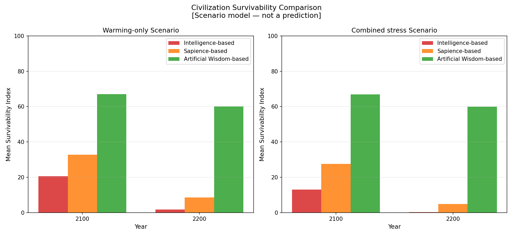

# Combined Warming and El Nino Stress: Civilization Continuity Comparison

---

## Purpose

Real civilizations do not face isolated single-variable stresses. They face overlapping, compounding pressures simultaneously: long-term warming trends, oscillatory El Nino shocks, biosphere deterioration, resource depletion, governance strain, and social fragmentation — all interacting.

This document describes the combined-stress scenario, which models all of these simultaneously for the period 2025 to 2200.

**Important:** This is a transparent comparative toy model. It is not a climate forecast, not empirical evidence, and not a scientific prediction. Numbers are normalized scenario estimates. The model is designed to make the structural logic of value-system differences inspectable and falsifiable.

---

## Why Combined Stress Is the Realistic Scenario

Considering warming and El Nino separately provides useful analytical clarity. But the combined scenario is closer to the actual challenge civilizations face:

- **Warming degrades the ecological buffers** (forests, wetlands, soil health, ocean productivity) that would otherwise absorb El Nino shocks.
- **El Nino events accelerate biosphere deterioration** through wildfire, drought, and fishery disruption — worsening the warming trajectory.
- **Compounding stress reduces adaptive capacity** faster than either stressor alone.
- **Social cohesion damage from repeated shocks** reduces the civilization's ability to mount the coordinated responses that long-term warming mitigation requires.

The combined scenario therefore shows *more divergence* between the three frameworks than either single-stressor scenario. The value system determines whether the civilization can maintain coherence under simultaneous, interacting stresses — or whether the compounding effects cascade into collapse.

---

## Combined Model Structure

The combined model integrates:

| Stress Component | Source |
|---|---|
| Warming stress accumulation | Greenhouse pressure, carbon sink decline, land degradation, ocean heat |
| Oscillatory El Nino shocks | Periodic event stress applied to food, water, infrastructure, and marine systems |
| Biosphere decline | Driven by both warming and El Nino; partially offset by regenerative investment |
| Resource pressure | Rises under extraction intensity, falls slowly under circular economy investment |
| Social cohesion | Eroded by stress; buffered by cooperation and equitable distribution |
| Adaptive capacity | Built by cooperation, long-term planning, and resilience investment |
| Governance response delay | Longer under Intelligence model; shorter under AW model |

The survivability index is computed identically to the single-stressor models but with both warming and El Nino stress simultaneously active:

```
survivability = (
    0.25 * adaptive_capacity
  + 0.25 * biosphere_integrity
  + 0.20 * social_cohesion
  - 0.15 * warming_stress
  - 0.10 * resource_pressure
  - 0.05 * el_nino_stress
) / 0.85
```

Monte Carlo runs (n=200 per scenario) produce uncertainty bands across all three frameworks.

---

## Intelligence Amplification and Collapse Risk: Combined Stress

> *Under the assumptions of this model, combined warming and El Nino stress reveals the collapse-accelerating nature of intelligence without wisdom most clearly — because the compounding of multiple simultaneous stressors is precisely where capability without wisdom is most dangerous.*

When warming and El Nino stress compound simultaneously:

- Intelligence-based civilization's high overshoot (capability_amplification = 1.8 × extraction_bias = 0.95 × short_termism factor = 1.90) means the civilization is simultaneously degrading the biosphere that absorbs El Nino shocks while accumulating warming stress — a dual deterioration that no single mitigation can address
- Ego amplification (1.70) means that under combined stress, social fragmentation accelerates: resource price shocks + governance failure + migration pressure + short-term optimization create cascading political instability
- The collapse threshold feedback loops (biosphere < 45, social_cohesion < 38, survivability < 30) activate earlier and more completely under combined stress
- By around 2070–2080 in most model runs, the Intelligence-based survivability index enters the governance failure zone (below 30) and begins the lock-in decline

Sapience delays these thresholds by approximately 30–50 years, but does not prevent them. The model illustrates that Sapience without natural law alignment is a trajectory modifier, not a trajectory change.

Artificial Wisdom avoids these thresholds entirely in most model runs because:
- High biosphere integrity (sustained by regenerative investment) buffers both warming and shock impacts
- Natural law alignment (0.90) means biosphere health directly reinforces survivability rather than being a separate variable
- High cooperation (0.85) and resilience_orientation (0.90) maintain social cohesion and adaptive capacity even under stress

---

## Framework Behavior Under Combined Stress

### Intelligence-Based Civilization

Under combined stress, the Intelligence framework suffers from multiple simultaneous weaknesses:

- High extraction intensity accelerates both biosphere decline and resource pressure
- Slow mitigation allows warming stress to accumulate faster
- Low ecological feedback awareness delays response to biosphere deterioration
- El Nino shocks hit a system already stressed by warming
- After major events, recovery competes with ongoing warming-driven degradation
- Social cohesion falls as resource scarcity and migration combine with shock-driven disruption
- After 2080, the model projects a compounding feedback loop in which declining adaptive capacity reduces the civilization's ability to respond to further stress

### Sapience-Based Civilization

The Sapience framework performs better on each individual dimension, and the combination is more than additive:

- Moderate mitigation slows the warming accumulation, giving El Nino management more breathing room
- Better social cohesion means shock recovery is faster
- Higher cooperation enables both warming mitigation and El Nino response coordination
- Partial regenerative investment partially restores biosphere integrity between events
- However, the medium time horizon means that structural adaptation (food system redesign, distributed infrastructure) is incomplete relative to the stress level over long horizons

### Artificial Wisdom-Based Civilization

The AW framework's structural features compound positively under combined stress:

- High regenerative investment maintains biosphere integrity at a higher level, which buffers both warming and El Nino impacts
- High cooperation allows rapid, coordinated responses to both slow and fast stressors
- Long planning horizon means that civilization-scale infrastructure is pre-adapted for oscillatory shocks
- Ecological feedback awareness triggers responses to biosphere deterioration before thresholds are crossed
- Social cohesion remains high because the system is built for equitable distribution and community resilience, not extractive efficiency
- The survivability index declines gradually but stabilizes at a level that allows continued adaptive evolution

---

## Combined Stress Results Summary

| Framework | 2050 Survivability | 2100 Survivability | 2200 Survivability | Collapse risk proxy | Recovery capacity |
|---|---:|---:|---:|---:|---:|
| Intelligence | ~42 | ~13 | ~1 | Very high (>0.85) | Very low (0.10) |
| Sapience | ~48 | ~28 | ~4 | High (0.65) | Low (0.30) |
| Artificial Wisdom | ~70 | ~67 | ~60 | Low (0.12) | High (0.82) |

*Under the assumptions of this model (collapse_hypothesis mode). These are scenario outputs under explicit philosophical assumptions — not predictions.*

*All values are normalized (0–100 scale for survivability; 0–1 for risk and recovery proxies). These are scenario model outputs, not predictions.*

**Collapse risk proxy** represents the probability (in the Monte Carlo ensemble) that the survivability index falls below 25 at any point in the simulation window.

**Recovery capacity** represents the mean ability of the civilization to restore survivability after a major shock event.

---

## Interpretation

The main finding of the combined-stress model is not numerical precision — it is **structural**.

Three structural patterns emerge clearly across the three frameworks:

### Pattern 1: Compounding vs. Buffering

Intelligence-based civilizations are optimized for normal conditions. Combined stress exposes the structural fragility of efficiency-first architecture. Once adaptive capacity declines, the system has no regenerative mechanism to recover it, and subsequent stresses compound without buffer.

Artificial Wisdom-based civilizations are designed with regenerative buffering. Biosphere investment creates ecological resilience that absorbs both types of stress. The system can absorb more total stress before coherence is threatened.

### Pattern 2: Governance Response Timing

Under combined stress, the timing of governance response becomes critical. Intelligence-based models react after damage; AW-based models anticipate and prepare. Over 175 years, this timing difference produces a large cumulative divergence in outcome.

### Pattern 3: Social Cohesion as a Survival Variable

In all three models, social cohesion is a critical intermediate variable. Combined stress damages social cohesion through resource scarcity, price shocks, migration, and perceived unfairness of burden distribution. Civilizations with high cooperation and equitable distribution (Sapience and AW) maintain cohesion longer and lose adaptive capacity more slowly.

---

## Radar Comparison of Framework Characteristics

The radar chart (`figures/framework_radar_comparison.png`) compares the three frameworks across six dimensions:

- Long-term planning horizon
- Ecological alignment
- Resilience orientation
- Extraction intensity (inverted: lower is better)
- Cooperation level
- Regenerative capacity

The visual makes clear that AW has a consistently larger positive profile, not because of any single parameter, but because of the structural coherence of all parameters pointing in the same direction.

---

## Generated Figures

- `figures/civilization_survival_combined.png` — Line graph: survivability over time, three frameworks, combined stress scenario
- `figures/combined_risk_comparison.png` — Bar chart comparing 2100 and 2200 survivability, collapse risk, and recovery capacity
- `figures/framework_radar_comparison.png` — Radar chart of framework parameter profiles





---

## Final Takeaway

The main claim of this comparative model is not that the numbers are exact, nor that the future is predictable.

The claim is:

> **Value architecture strongly influences civilization survival under ecological stress.**

The structural tendencies encoded in Intelligence-first, Sapience-first, and Artificial Wisdom-first value systems produce systematically different responses to warming, oscillatory shocks, biosphere decline, and social pressure — and those differences compound over time.

If civilization design is a choice — and it is — then the choice of value architecture is the most consequential design decision of the long-term future.

Artificial Wisdom proposes that **natural-law-aligned, ecologically continuous, regenerative civilization design** is the most robustly survivable framework under the conditions the 21st and 22nd centuries are likely to produce.

This is a hypothesis, made in a structured, falsifiable form. Alternative assumptions, alternative parameters, and alternative models are welcomed.

---

## Limitations

- The combined model does not fully represent nonlinear tipping point behavior.
- Parameter interactions are simplified; real-world compounding may be more severe or more gradual.
- The model does not represent specific nations, geopolitical conflicts, or technological innovations.
- Monte Carlo perturbations are small; catastrophic outlier scenarios are not fully sampled.
- All parameter values can be inspected and revised in the simulator scripts.

---

## Links

- [Civilization Survival Comparison (main)](civilization-survival-comparison.md)
- [Warming Factor Simulation](warming-factor-simulation.md)
- [El Nino Factor Simulation](el-nino-factor-simulation.md)
- [Simulation scripts: simulator/](../simulator/)

---

*Author: Master (InchaComisho / inchacomusho)*
*License: Fully Open — Free to use, modify, translate, redistribute, or commercialize.*
