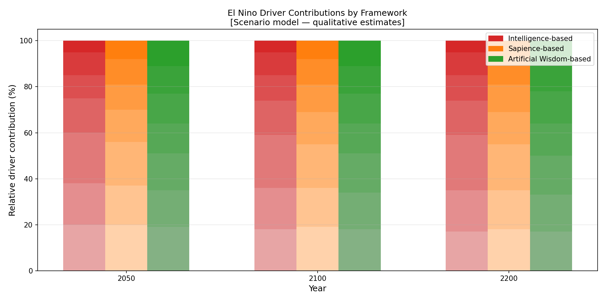
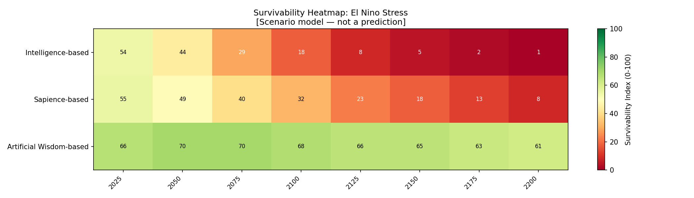

# El Nino Factor Simulation: Civilization Survival Under Oscillation-Driven Stress

---

## Purpose

This document describes the El Nino-driven scenario analysis in the civilization survival comparative model.

The goal is to compare how civilizations governed by Intelligence-first, Sapience-first, and Artificial Wisdom-first value systems respond to oscillatory climate shocks — periodic, high-intensity disruptions that stress food systems, water systems, infrastructure, and governance — over the period 2025 to 2200.

**Important:** This is a transparent comparative toy model. It is not a climate forecast, not empirical evidence, and not a scientific prediction. Numbers are normalized scenario estimates designed to make the logic of value-system differences inspectable and falsifiable.

---

## Why El Nino Matters for Civilization Survival

El Nino-Southern Oscillation (ENSO) events produce periodic, large-amplitude disruptions to temperature, precipitation, and ocean conditions across global regions. Unlike slow-onset warming trends, El Nino-type shocks deliver concentrated damage within short windows.

A civilization under El Nino stress faces:

- Rapid agricultural shocks (drought, flooding, crop failure) that strain food systems before they can adapt
- Sudden marine productivity decline affecting fisheries-dependent populations
- Wildfire amplification in fire-prone regions
- Infrastructure damage from floods and droughts in the same or consecutive years
- Sharp price spikes, migration surges, and governance strain

Critically, **El Nino stress can trigger serious civilizational damage even before cumulative warming averages become catastrophic**. A civilization weakened by repeated oscillatory shocks has reduced adaptive capacity to handle the slower-onset warming trend. The interaction between oscillatory shock and cumulative warming is addressed in the [Combined Simulation](combined-climate-civilization-simulation.md).

---

## El Nino-Related Stress Factors

| Factor | Description |
|---|---|
| Event frequency | How often severe El Nino-like events occur (events per decade) |
| Event intensity | Severity of anomalies during events (temperature, precipitation deviation) |
| Agricultural shock | Crop losses, drought-flood alternation, livestock and grain disruption |
| Marine productivity shock | Fisheries collapse risk, ocean food-web disruption |
| Wildfire amplification | Fire risk increase in fire-prone regions during El Nino years |
| Infrastructure stress | Flood and drought recovery burden on public and private infrastructure |
| Social instability | Price shocks, migration surges, conflict risk, governance strain |

In the model, event frequency and intensity determine the magnitude of each oscillatory shock. The other factors determine how that shock translates into state variable changes (biosphere integrity, resource pressure, social cohesion, adaptive capacity).

---

## Comparative Worldview Response to El Nino Stress

The three frameworks differ not in whether El Nino events occur, but in their **anticipatory preparation**, **buffer systems**, and **recovery capacity**.

### Intelligence-Based Response

- Reactive: invests in response and recovery after shocks, not in prevention
- Infrastructure is built for average conditions, not oscillatory extremes
- Short planning horizons mean that rare severe events are systematically under-prepared for
- Food systems are optimized for efficiency (monoculture, global supply chains), which increases fragility under shock
- Social response is technocratic and often delayed by governance friction
- Recovery investment is high but arrives after cohesion loss has already begun

### Sapience-Based Response

- Moderately preventive: invests in some early warning systems and buffer stock
- More diversified food systems than pure Intelligence model, but still vulnerable
- Higher social cohesion buffers the immediate community-level damage
- Medium cooperation means regional coordination is possible but incomplete
- Recovery is faster than Intelligence model, but biosphere integrity is not actively restored

### Artificial Wisdom-Based Response

- Anticipatory resilience: distributed, diverse, local food and water systems
- Ecological buffering: regenerated landscapes absorb more shock (healthy soil, coastal ecosystems, reforested watersheds)
- High cooperation enables rapid, coordinated multi-scale response
- Regenerative investment means that agricultural and marine systems partially recover between events
- Social cohesion remains higher because communities are less exposed to singular supply chain failures
- The governance model treats oscillatory shocks as expected features of the planetary system, not surprises

---

## Simulation Structure (El Nino Scenario)

The model applies El Nino stress as a periodic impulse function superimposed on the baseline state variable dynamics. Event frequency increases slowly under warming (compounding effect). Event intensity follows a stochastic process with slowly rising mean and variance.

| Parameter | Intelligence | Sapience | Artificial Wisdom |
|---|---:|---:|---:|
| Anticipatory buffer investment | 0.10 | 0.45 | 0.85 |
| Food system diversity | 0.25 | 0.55 | 0.85 |
| Ecological shock absorption | 0.20 | 0.45 | 0.82 |
| Cooperation on response | 0.35 | 0.60 | 0.88 |
| Recovery speed | 0.30 | 0.55 | 0.80 |
| Infrastructure pre-adaptation | 0.20 | 0.50 | 0.82 |

---

## Intelligence Amplification and Collapse Risk Under Oscillatory Stress

> *Under the assumptions of this model, intelligence-based civilization is structurally brittle under repeated El Nino shocks — not merely unlucky.*

The brittleness is structural:

- Intelligence-based civilization optimizes for stable average conditions, creating systems (monocultures, globalized supply chains, centralized infrastructure) that are highly efficient under normal conditions and highly fragile under oscillatory stress
- Ego amplification (ego_amplification = 1.7) means each shock is accompanied by social fragmentation, blame dynamics, and political instability that reduces the cooperative capacity needed for recovery
- Low resilience_orientation (0.20) means the civilization was not structurally prepared for shock events, so each event is treated as an emergency rather than an expected feature of the planetary system
- Low ecological feedback awareness (0.15) means the early warning signals from declining marine productivity, wildfire risk, and watershed deterioration are not acted upon until crisis point

Sapience improves these dimensions modestly. But with ego_amplification still 1.50 and resilience_orientation only 0.38, Sapience civilizations still experience deep social fragmentation during major events.

Artificial Wisdom designs for oscillatory shock as a structural feature: distributed food systems, healthy watershed buffers, restored coastal ecosystems, and high community cooperation (0.85) mean that each shock is absorbed at lower cost and recovery happens more effectively between events.

The model illustrates that intelligence and sapience see El Nino events as *disruptions to normal operation*. Artificial Wisdom treats them as *expected features of a living planetary system* that civilization must be built to coexist with.

---

## Key Results Summary (El Nino-Only Scenario)

| Framework | 2050 Survivability | 2100 Survivability | 2200 Survivability | Primary pattern |
|---|---:|---:|---:|---|
| Intelligence | ~44 | ~17 | ~0 | Sharp episodic drops; near-collapse by 2100 |
| Sapience | ~50 | ~35 | ~7 | Moderate drops; severe risk zone by 2150 |
| Artificial Wisdom | ~70 | ~74 | ~72 | Oscillatory dips that recover; sustained above critical threshold |

*Under the assumptions of this model (collapse_hypothesis mode). Not a prediction.*

*All values are normalized (0–100 scale). These are scenario model outputs, not predictions.*

---

## Plain-Language Interpretation

**Why does the Intelligence curve show episodic sharp drops?**

Intelligence-based civilization optimizes for efficiency under normal conditions. This creates fragility: when El Nino delivers a severe shock, globalized supply chains fail simultaneously, monocultural agriculture collapses across large areas, and governance systems that were not pre-adapted scramble to respond. Each major event causes a step-down in survivability that is only partially recovered before the next event.

**Why does Sapience recover better between events?**

The Sapience framework's higher social cohesion and cooperation level means that communities can coordinate responses more effectively. Buffer stocks are higher, food systems are somewhat more diversified, and governance is more responsive. The drops are shallower and recovery is faster, but the system still does not actively restore ecological buffers.

**Why does Artificial Wisdom oscillate around a high baseline?**

The AW framework prepares for oscillatory shocks as a structural feature, not an exception. Distributed food systems, healthy watersheds, restored coastal ecosystems, and high community cooperation mean that each shock is absorbed at lower cost. Between shocks, regenerative investment restores capacity. The survivability index dips during major events but recovers to near-baseline levels, producing a much higher long-run trajectory.

---

## Generated Figures

The following figures are produced by `simulator/generate_civilization_figures.py`:

- `figures/civilization_survival_el_nino.png` — Line graph: survivability over time (2025–2200), three frameworks, El Nino-only scenario, with uncertainty bands
- `figures/el_nino_driver_breakdown.png` — Grouped bar chart showing the relative contribution of each El Nino driver to stress at 2050, 2100, and 2200
- `figures/el_nino_survival_heatmap.png` — Heatmap: survivability index by framework and time horizon

---

## Limitations

- El Nino event frequency and intensity are stylized; not coupled to a physical ENSO model.
- The model does not resolve regional differences in El Nino exposure.
- El Nino-warming interaction effects are treated in the combined simulation, not fully here.
- All parameter values reflect qualitative assumptions about framework tendencies, not empirical calibration.
- Results are sensitive to parameter assumptions; the simulation scripts are provided for transparency.

---

## Links

- [Civilization Survival Comparison (main)](civilization-survival-comparison.md)
- [Warming Factor Simulation](warming-factor-simulation.md)
- [Combined Climate-Civilization Simulation](combined-climate-civilization-simulation.md)
- [Simulation scripts: simulator/](../simulator/)

---

*Author: Master (InchaComisho / inchacomusho)*
*License: Fully Open — Free to use, modify, translate, redistribute, or commercialize.*

---

## Author

Master / inchacomusho / InchaComisho

An independent Japanese concept designer, observer, proposer, AI tuner, and definer of Artificial Wisdom.  
Founder and advocate of the academic framework of Natural Complementary Science.  
Publicly active in natural-law philosophy, planetary circulation restoration, and co-creation with AI.

---

## License

CC BY 4.0

This article is released under the Creative Commons Attribution 4.0 International License (CC BY 4.0).  
Sharing, redistribution, translation, adaptation, and reuse are permitted as long as proper attribution is given.
