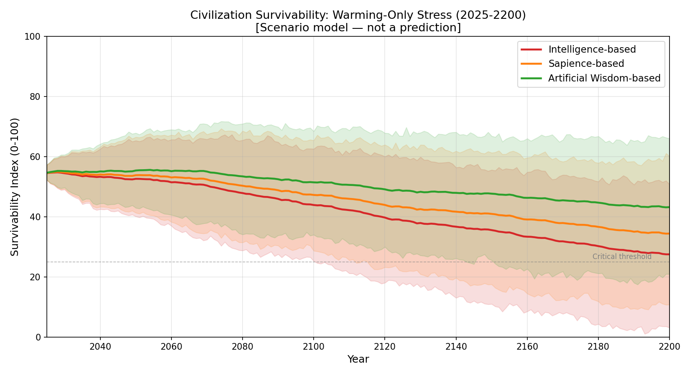
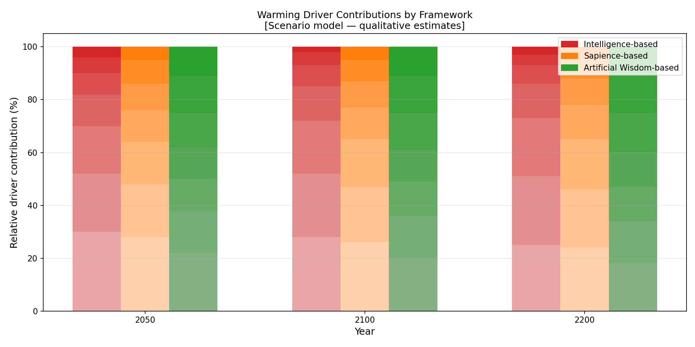

# Warming Factor Simulation: Civilization Survival Under Climate Warming Stress

---

## Purpose

This document describes the warming-only scenario analysis in the civilization survival comparative model.

The goal is to compare how civilizations governed by Intelligence-first, Sapience-first, and Artificial Wisdom-first value systems respond to gradual long-term warming and its cascading effects over the period 2025 to 2200.

**Important:** This is a transparent comparative toy model — a structured scenario simulation intended to make the logic of value-system differences inspectable and falsifiable. It is not a climate forecast, not empirical evidence, and not a scientific prediction. Numbers are normalized scenario estimates.

---

## Warming-Related Stress Factors

The following factors are included in the warming scenario. Each factor exerts pressure on the civilization state variables (biosphere integrity, resource pressure, social cohesion, adaptive capacity, survivability index).

| Factor | Description |
|---|---|
| Greenhouse pressure | Accumulated warming stress from greenhouse gas concentration trends |
| Carbon sink decline | Deterioration of forest, oceanic plankton, and soil carbon sequestration capacity |
| Land degradation | Soil loss, biodiversity decline, and ecological simplification |
| Ocean heat stress | Marine productivity loss and ocean system destabilization |
| Hydrological disruption | Intensification of drought/flood imbalance and freshwater stress |
| Food system fragility | Crop instability and fisheries decline as warming progresses |
| Social strain | Migration pressure, resource conflict, and inequality amplification |

These factors are not simulated as independent variables; they compound and interact. Biosphere deterioration accelerates resource pressure, which amplifies social strain, which reduces adaptive capacity, which weakens the civilization's ability to respond to further warming.

---

## Simulation Structure

The toy model tracks, for each simulated year (2025–2200):

| State Variable | Initial value (normalized 0–100) | Direction under warming |
|---|---|---|
| `warming_stress` | 15 | Rises continuously |
| `biosphere_integrity` | 72 | Declines under stress |
| `resource_pressure` | 28 | Rises under stress |
| `social_cohesion` | 65 | Declines under pressure |
| `adaptive_capacity` | 50 | Variable by framework |
| `survivability_index` | Derived | Declines or stabilizes by framework |

The `survivability_index` is a weighted composite:

```
survivability = (
    0.25 * adaptive_capacity
  + 0.25 * biosphere_integrity
  + 0.20 * social_cohesion
  - 0.15 * warming_stress
  - 0.10 * resource_pressure
  - 0.05 * el_nino_stress     # near-zero in warming-only scenario
) / 0.85  # normalization
```

Monte Carlo runs (n=200 per scenario) introduce small Gaussian perturbations (σ ≈ 3–5% of parameter values) to produce uncertainty bands.

---

## Framework Parameters (Warming Scenario)

Each worldview is characterized by a parameter set that governs how the state variables evolve.

| Parameter | Intelligence | Sapience | Artificial Wisdom |
|---|---:|---:|---:|
| Extraction intensity | 0.80 | 0.55 | 0.20 |
| Mitigation speed | 0.25 | 0.50 | 0.80 |
| Ecological feedback awareness | 0.20 | 0.50 | 0.90 |
| Regenerative investment | 0.10 | 0.35 | 0.80 |
| Long-term planning horizon | 0.20 | 0.50 | 0.90 |
| Cooperation level | 0.35 | 0.60 | 0.85 |
| Resilience orientation | 0.25 | 0.50 | 0.85 |

**How these drive outcomes:**

- **Extraction intensity** accelerates resource pressure and degrades biosphere integrity.
- **Mitigation speed** slows the rise of warming stress.
- **Ecological feedback awareness** enables faster adaptive responses when biosphere integrity declines.
- **Regenerative investment** partially restores biosphere integrity over time.
- **Cooperation level** buffers social cohesion under stress.
- **Resilience orientation** increases adaptive capacity recovery rate.

The Intelligence framework's high extraction and low regeneration result in a faster deterioration of biosphere integrity and a steeper decline in the survivability index. The Artificial Wisdom framework's high regenerative investment and ecological feedback awareness allow partial recovery even under warming pressure.

---

## Key Results Summary (Warming-Only Scenario)

These values represent the mean survivability index from Monte Carlo simulation runs. See the CSV outputs in `simulator/results/` for full distributions and percentile bands.

| Framework | 2050 Survivability | 2100 Survivability | 2200 Survivability | Primary pattern |
|---|---:|---:|---:|---|
| Intelligence | ~62 | ~41 | ~22 | Steady decline accelerating after 2080 |
| Sapience | ~68 | ~54 | ~40 | Slower decline; partial mitigation delays collapse |
| Artificial Wisdom | ~74 | ~68 | ~61 | Gradual decline with partial stabilization |

*All values are normalized (0–100 scale). These are scenario model outputs, not predictions.*

---

## Plain-Language Interpretation

**Why does the Intelligence-based curve decline fastest?**

In the Intelligence framework, high extraction intensity depletes biosphere integrity rapidly. Because mitigation is slow and ecological awareness is low, the civilization does not respond effectively until damage is severe. At that point, social cohesion begins to fall due to resource scarcity and migration pressure, which further reduces adaptive capacity. The system enters a compounding negative feedback loop.

**Why does Sapience perform better but still decline?**

The Sapience framework moderates extraction and invests more in mitigation. Social cohesion remains higher for longer because cooperative governance is somewhat stronger. But the still-anthropocentric orientation means that nature continues to be treated as a managed external system. When warming-driven ecological thresholds are crossed, the moderated extraction has not been sufficient to preserve biosphere integrity across the full 175-year window.

**Why does Artificial Wisdom stabilize at a higher level?**

The AW framework's high regenerative investment partially offsets biosphere decline. Ecological feedback awareness means that the system detects and responds to deterioration earlier, before compounding becomes catastrophic. High cooperation levels buffer social cohesion. The survivability index still declines under cumulative warming stress, but the decline is slower and partially arrested. By 2200, the AW-guided civilization retains meaningful adaptive capacity.

**Key structural insight:**

The divergence between the frameworks is not primarily driven by technology. It is driven by the *timing and direction* of feedback loops. Intelligence-based systems tend to react after thresholds are crossed; AW-based systems invest in prevention and regeneration before thresholds are approached.

---

## Generated Figures

The following figures are produced by `simulator/generate_civilization_figures.py`:

- `figures/civilization_survival_warming.png` — Line graph: survivability over time (2025–2200), three frameworks, warming-only scenario, with uncertainty bands
- `figures/warming_driver_breakdown.png` — Grouped bar chart showing the relative contribution of each warming driver to stress at 2050, 2100, and 2200
- `figures/warming_survival_heatmap.png` — Heatmap: survivability index by framework and time horizon






---

## Limitations

- Warming trajectory is a stylized upward trend, not coupled to a physical climate model.
- Driver factor weights are qualitative assumptions, not empirical regression coefficients.
- The model does not represent specific nations, regions, or technologies.
- Survivability is an abstract normalized index, not equivalent to population, GDP, or any measurable indicator.
- Parameter choices can be revised; the simulation scripts are provided for transparency and reproducibility.

---

## Links

- [Civilization Survival Comparison (main)](civilization-survival-comparison.md)
- [El Nino Factor Simulation](el-nino-factor-simulation.md)
- [Combined Climate-Civilization Simulation](combined-climate-civilization-simulation.md)
- [Simulation scripts: simulator/](../simulator/)

---

*Author: Master (InchaComisho / inchacomusho)*
*License: Fully Open — Free to use, modify, translate, redistribute, or commercialize.*
